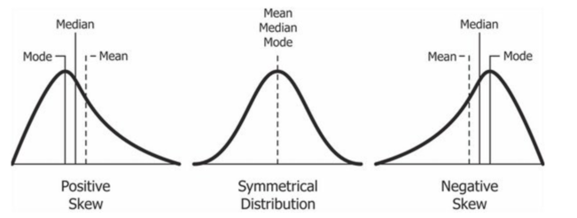
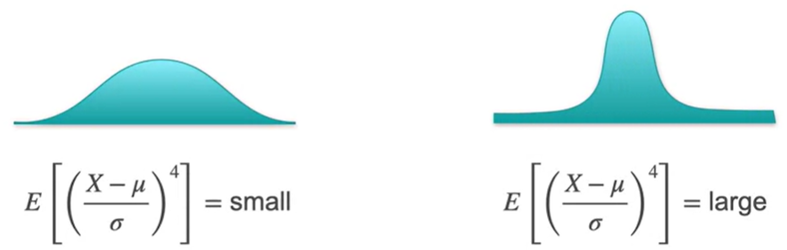
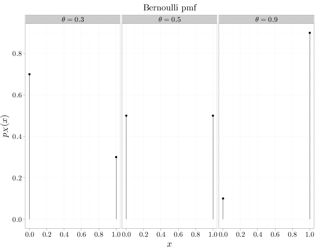
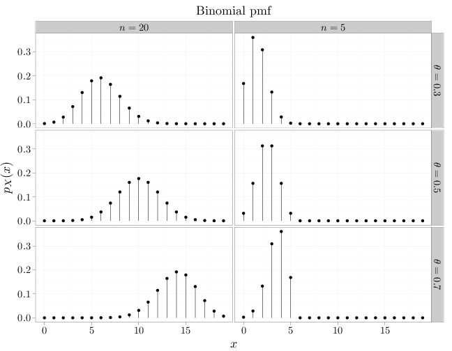
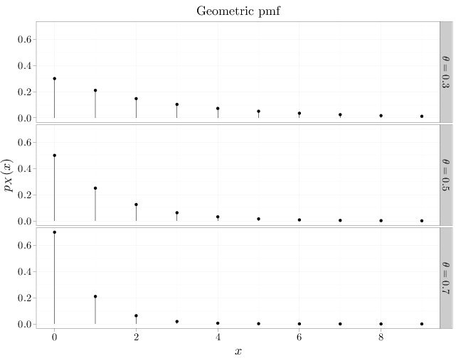
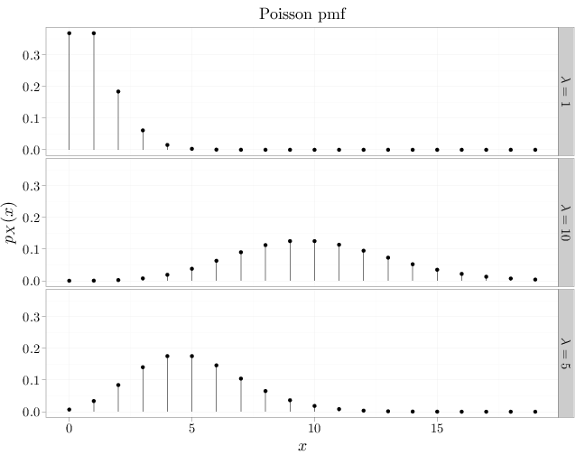
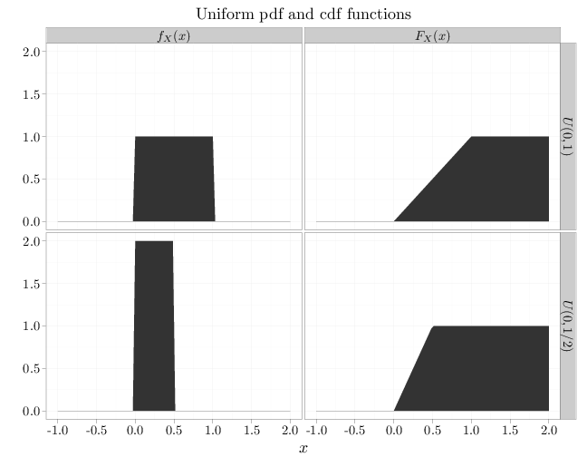
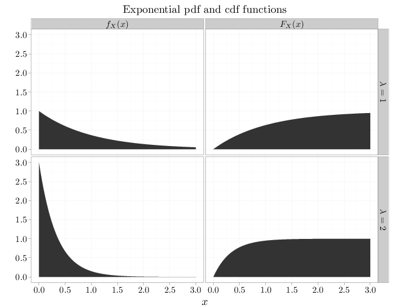
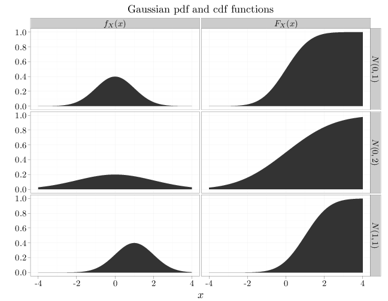
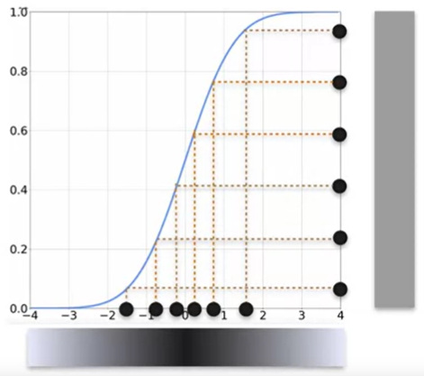

# Probability and Statistics

## Basics

### What is Probability?

#### Frequentist Interpretation
This approach defines an event's probability (Also known as *physical probability*) as the limit of its relative frequency in many trials (the long-run probability)

> **Example:**
> If you toss a coin a large (ideally, *infinite*) number of times, the probability of heads can be determined as the frequency the coin flip resulting in heads

#### Bayesian Interpretation
This approach defines an event's probability (Also known as *Evidential probability*) as reasonable expectation representing a state of knowledge or as quantification of a personal belief.. This means, if we have a different level of knowledge about the same event, the estimate of the probability will be different.

> **Example:**
> If you hold an election, the probability of a particular candidate winning can be defined as the expectation of the candidate winning with the consideration of all the knowledge (and uncertainties) about the event

A more detailed explaination can be found in this [Youtube Video](https://youtu.be/pJyKM-7IgAU?t=85) and this [Wikipedia Article](https://en.wikipedia.org/wiki/Probability_interpretations)

### Definitions

1. **Sample Space** - A sample space $\Omega$ associated with a random experiment is the set of all possible outcomes of the experiment

2. **Event** - An event $E$ is a subset of the sample space $\Omega$, or in other words a set of possible outcomes.

Both Sample Space and Event can be finite, countably infinite, or uncountably infinite. For example, consider a random experiment of throwing a dart at a round board without missing the board. Assuming the radius of the board is 1, the sample space is the set of all two dimensional vectors inside the unit circle - 
$$\Omega=\{(x,y)\,:\, x,y\in\mathbb{R}, \,\sqrt{x^2+y^2} < 1\}$$
An event describing a bullseye hit is - 
$$E=\{(x,y)\, : \,x,y\in\mathbb{R}, \,\sqrt{x^2+y^2} < 0.1\}\subset\Omega.$$

both the sample space $\Omega$ and the event $E$ are uncountably infinite

### Boole's Inequality
$$ P(\bigcup_{i} A_i) \leq \sum_i P(A_i)$$

This is derived from the equation $P(A \cup B) = P(A) + P(B) - \boxed{P(A \cap B)}$

## Conditional Probability

If A & B are two events and $P(B) > 0$,

$$P(A|B) = \frac{P(A \cap B)}{P(B)}$$

* If $A \subset B$, $P(A|B) = \frac{P(A)}{P(B)}$
* If $B \subset A$, $P(A|B) = \frac{P(B)}{P(B)} = 1$

### Pairwise Independence
A finite number of events $A_1, A_2, ... , A_n$ are pairwise independent if every pair $A_i, A_j, i \neq j$ are independent

### Independence
A finite number of events $A_1, A_2, ... , A_n$ are independent if every subset of event from the set of events is independent of every other subset of events. Independence implies - 
$$P(A_1 \cap A_2 \cap ... A_n) = P(A_1).P(A_2)...P(A_n)$$

### Conditional Independence
A and B are conditionally independent if

$$ P(A \cap B | C) = P(A|C).P(B|C) $$

### General Multiplication rule
$$ P (A_1 \cap A_2 \cap ... A_n) = P(A_1).P(A_2|A_1).P(A_3|A_1 \cap A_2)...P(A_n| A_1 \cap A_2 ... A_{n-1})$$

> **NOTE:**
> * Pairwise independence is a weaker condition than independence
> * If $A$ and $B$ are independent, $P(A|B) = P(A)$
> * If $A$ and $B$ are disjoint, $P(A|B) = 0$, meaning they are not independent
> * If $A$ and $B$ are independent, $A^c$ and $B$ are also independent

## Baye's Theorem
If A & B are two events and $P(A) \neq 0$, $P(B) \neq 0$,
$$P(A|B) = \frac{P(B|A).P(A)}{P(B)}$$

### Law of total probability
For an exhaustive set of events $A_1, A_2, ... , A_n$
$$P(B) = \sum_{i} P(B|A_i)(A_i)$$

## Random Variables

A random variable (RV) $X$ is a function from the sample space $\Omega$ to the real numbers $X:\Omega \to \mathbb{R}$. Assuming $E \subset R$ we denote the event $\{ \omega \in \Omega : X(\omega) \in E \} \subset \Omega$ by $X \in E$

> **Example:**
> Tossing three fair coins, the RV $X$ can be defined as the count of the number of heads

* A random variable $X$ is discrete if $P(X \in K) = 1$ for some finite or countably infinite set $K \subset \mathbb{R}$.
* A random variable $X$ is continuous if $P(X=x)=0$ for all $x \in \mathbb{R}$

> **Example:**
> Throwing two fair dice, $\Omega=\{ \omega = (a,b): a \in \{1,…,6\},b \in \{1,…,6\}\}$, the RV $X(a,b)=a+b$

> **Example:**
> In the dart throwing experiment, the sample space is $\Omega=\{(x,y):\sqrt{x^2+y^2}<1\}$.
> * The RV $V$, which is 1 for a bullseye and 0 otherwise, is discrete since $P(V \in {0,1}) = 1$.
> * The RV $W$, defined as $W(x,y)=\sqrt{x^2+y^2}$, represents the distance of between the dart position and the origin. Since the 2-D area of a circle $\{W=w\} = \{(x,y):x,y \in \mathbb{R}, \sqrt{x^2+y^2}= w \}$ is zero for all w, $P(W=w)=Area(\{W=w\})/(π1^2)=0$ (under the classical model), implying that W is a continuous RV

### Probability Distributions

#### Cumulative Probability Distribution
We define the cumulative distribution function (cdf) with respect to an RV $X$ to be $F_X:\mathbb{R} \to \mathbb{R}$ given by $F_X(x) = P(X \leq x)$

#### Discrete RV - Probability Mass Function
Given a discrete RV $X$, we define the associated probability mass function (pmf) $p_X: \mathbb{R} \to \mathbb{R}$ to be $p_X(x)=P(X=x)$.

> **Example:**
> In the coin toss example
> 
> $$\begin{align*}
p_X(x)=P(X=x)=\begin{cases} 1/8 & x=0 \\
3/8 & x=1 \\
3/8 & x=2\\
1/8 & x=3 \\
0 & \text{else}
\end{cases} \qquad
F_X(x)=P(X\leq x)=\begin{cases} 0 & x < 0 \\
1/8 & 0\leq x < 1 \\
1/2 & 1\leq x <  2\\
7/8 & 2\leq x < 3 \\
1 & 3 \leq x
\end{cases}.
\end{align*}$$

For the PMF
* $p_X(x) \geq 0$
* $\sum_x p_X(x) = 1$

#### Continuous RV - Probability Density Function
Given a continuous RV $X$, we define the associated probability density function (pdf) $f_X: \mathbb{R} \to \mathbb{R}$ as the derivative of the cdf $f_X=F'_X$ where it exists, and 0 elsewhere.

> **Example:**
> 
> $$\begin{align*}
F_R(r)&=P(R\leq r)=\begin{cases} 0 & r < 0 \\
\pi r^2 / (\pi 1^2)=r^2 & 0\leq r < 1\\
1 & 1\leq r
\end{cases}, \\
f_R(r)&=\frac{dF_R(r)}{dr}=\begin{cases} 0 &  r<0 \\
2r & 0\leq r <1\\
0 & 1\leq r
\end{cases}.
\end{align*}$$
> 
> **NOTE:** The PDF can have a value greater than 1

For the PDF
* $f_X$ is a non-negative function
* $\int_{\mathbb{R}} f_X(x)dx=1$

## Basic Statistical Quantities

### Expectation
If $X$ is a discrete RV

$$ E(X) = \sum_{x} x, p_X(x)$$

If $X$ is a continuous RV

$$ E(X) = \int_{-\infty}^{\infty} x \, f_X(x)$$

#### Expectations for functions of random variables

If $X$ is a discrete RV

$$ E(g(X)) = \sum_y y p_{g(X)}(y) = \sum_{x} g(x) p_X(x) $$

If $X$ is a continuous RV

$$ E(g(X)) = \int y f_{g(X)}(y)dy = \int_{-\infty}^{\infty} g(x) f_X(x)dx $$

A major property of expectations is $E(aX+b)=a E(X) + b$

> **Illustration:**
> *Consider a set of letters addressed to each person in the world (with a population of ~7B), if you were to randomly deliver the letter to each person, what is expectation of the number of letters that were delivered to the right addressee?*
> 
> Consider the expectation of getting a single addressee right. Let's call this person $A_1$. The expectation of delivering the right letter to this person is $E(A_1) = \frac{1}{7B}$. Now, since the total expectation is just the sum of all individual expectations, we have $E(Total) = E(A_1) + E(A_2) + ... + E(A_{7B}) = 1$. Therefore, on average, we can expect to deliver 1 letter to the right person.

### Variance and Standard Deviation
The variance of an RV $X$ is the expectation of the RV $Y=(X−E(X))^2$

$$ \begin{align*}
Var(X)  &= E\left((X-E(X))^2\right) \\
        &=E(X^2)-(E(X))^2
\end{align*} $$

A major property of expectations is - $Var(aX+b)=a^2Var(X)$

Standard deviation is the square-root of variance

$$ \sigma_x = \sqrt{Var(x)} = \sqrt{E(X^2)-(E(X))^2}$$

> **Sample Variance ($s^2$)**
> 
> Our goal with the sample variance is to provide an estimate of the population variance that is correct on average (unbiased). That is, we want that distribution of $s^2$ to be centered on $\sigma^2$. Mathematically,
> 
> $$E[s^2] = \sigma^2$$
> 
> We have the equation for an unbiased estimation of $s^2$ as
> 
> $$s^2 = \frac{\Sigma (x_i - \bar{x})^2}{n-1}$$
> 
> Let us prove that the expectation of this quantity approaches the variance of the population
> 
> $$\begin{align*} E[s^2] &= E\left[ \frac{\Sigma (x_i - \bar{x})^2}{n-1} \right] \\ &= \frac{1}{n-1}E\left[ \Sigma x_i^2 - 2\bar{x}\Sigma x_i + n\bar{x}^2 \right] \\ &= \frac{1}{n-1}E\left[ \Sigma x_i^2 - 2\bar{x}(n\bar{x}) + n\bar{x}^2 \right] \\ &= \frac{1}{n-1}E\left[ \Sigma x_i^2 - n \bar{x}^2 \right] \\ &= \frac{1}{n-1} \Sigma E\left[x_i^2\right] - n E\left[\bar{x}^2\right] \end{align*}$$
> 
> Now, we know that
> * $x_i$ are IID samples from a distribution with mean $\mu$ and variance $\sigma^2$. Therefore, $E[x_i^2] = \mu^2 + \sigma^2$
> * $\bar{x}$ forms a distribution with mean $\mu$ and variance $\sigma^2/n$ (from *Central Limit Theorem*). Therefore, $E[\bar{x}^2] = \mu^2 + \sigma^2/n$
> 
> $$\begin{align*} E[s^2] &=  \frac{1}{n-1} \left[ \Sigma (\mu^2 + \sigma^2) - n(\mu^2 + \sigma^2/n)\right] \\ &= \frac{1}{n-1} \left[ n\mu^2 + n\sigma^2 - n\mu^2 - \sigma^2\right] \\ &= \frac{1}{n-1} (n-1)\sigma^2 \\ &= \sigma^2 \end{align*}$$
> 
> **Summary**
> * [*Unbiased Variance Visualization*](https://www.khanacademy.org/computer-programming/unbiased-variance-visualization/1167453164) - using $n$ as the denominator, we always underestimate the value of the variance and hence the expectation of sample variance is biased and never converges to the population variance
> * $s^2$ uses the sample mean $\bar{x}$ and not the population mean, and hence the deviations are always calculated w.r.t the sample mean and hence will always be less variable w.r.t the sample mean. This underestimation is compensated by using $n-1$ in the denominator.
> * Consider each $x_i$ to provide an independent piece of information about the population. Since, the calculation of sample mean has already given us one statistical piece of information, the deviations ($x_i - \bar{x}$) from this sample mean will only have $n-1$ degrees of freedom. Hence, we use $n-1$ since we are using the deviations to calculate the sample variance.

### Covariance and Correlation
The covariance of RVs $X$ and $Y$ is the measure of linear relationship between the two variables.

$$ \begin{align*}
Cov(X, Y)  &= E\left[(X-E(X))(Y-E(Y))\right] \\
        &=E(XY)-E(X)E(Y)
\end{align*} $$

From the definition of covariance as the expectation of $(X-E(X))(Y-E(Y))$, we can define the covariance using joint probability distributions as -

$$Cov(X,Y)=\mathop{\sum\sum}\limits_{(x,y)\in S} (x-\mu_X)(y-\mu_Y) p_{XY}(x,y)$$

$$Cov(X,Y)=\int_{S_2} \int_{S_1} (x-\mu_X)(y-\mu_Y) f_{XY}(x,y) dx dy$$

 

The normalized form of covariance is a quantity varying between $-1$ and $1$ called **correlation**.

$$ \rho_{xy} = \frac{Cov(X, Y)}{\sigma_x \sigma_y} $$

### Skewness and Kurtosis
**Skewness** is a measure of the asymmetry of the probability distribution of a real-valued random variable about its mean.

Skewness can be calculated for a random variable X as the expectation of the [*third standardized moment*](https://en.wikipedia.org/wiki/Standardized_moment) - 

$$ Skewness = \tilde{\mu}_3 = E \left[ \left( \frac{X-\mu}{\sigma}\right)^3 \right]$$

$Skewness > 0 \to$ Positive skewed distribution is also called *right-skewed*.

$Skewness < 0 \to$ Negative skewed distribution is also called *left-skewed*.

 

**Kurtosis** is a measure of the "tailedness" of the probability distribution of a real-valued random variable. Kurtosis can be calculated for a random variable X as the expectation of the [*fourth standardized moment*](https://en.wikipedia.org/wiki/Standardized_moment) - 

$$ Kurtosis = \tilde{\mu}_4 = E \left[ \left( \frac{X-\mu}{\sigma}\right)^4 \right]$$

A *Small Kurtosis* implies skinnier tails of the distribution, whereas, a *Large Kurtosis* implies a thicker tails of the distribution.

## Discrete RV Distributions

### Bernoulli Trials
The Bernoulli trial RV may be used to characterize the probability that an experiment (or trial) that may either succeed, $X=1$, or fail, $X=0$, with probabilities $\theta$, $1−\theta$ respectively. The Bernoulli trial RV, $X\sim\text{Ber}(\theta)$ where $\theta\in[0,1]$ has the PMF given by -

$$p_X(x)=\begin{cases} \theta & x=1\\
1-\theta & x=0\\
0&\text{otherwise}\end{cases}$$

#### Expectation & Variance

$$ E(X) = \theta \qquad Var(X) = \theta(1-\theta) $$

### Binomial Distribution

> **Binomial Theorem**
> 
> $(a+b)^n = \sum_{x=0}^{n} {n \choose x} a^x b^{n-x}$

The Binomial RV counts the number of successes in $n$ independent Bernoulli experiments with parameter $\theta$, regardless of the ordering of the results of the experiments. The Binomial RV, $X\sim\text{Bin}(n,\theta)$ where $\theta\in[0,1], n\in\mathbb{N}^0$ has the PMF given by -

$$p_X(x)=\begin{cases}
{n \choose x} \theta^x (1-\theta)^{n-x} &  x=0,1,\ldots,n\\
0 & \text{otherwise}
\end{cases}$$

#### Expectation & Variance

$$ E(X) = n\theta \qquad Var(X) = n\theta(1-\theta) $$

When the parameter $n$ in the binomial distribution is set to 1, the binomial distribution simplifies to a bernoulli trial.

### Geometric Distribution
The geometric RV is the number of failures we encounter in a sequence of independent Bernoulli experiments with parameter $\theta$ before encountering success. The Geometric RV, $X\sim\text{Geom}(\theta)$ where $\theta\in[0,1]$ has the PMF given by -

$$p_X(x)=\begin{cases}\theta(1-\theta)^x & x\in\mathbb{N}\cup\{0\}\\
0 &\text{otherwise}\end{cases}$$

#### Expectation & Variance

$$ E(X) = \frac{1 - \theta}{\theta} \qquad Var(X) = \frac{1-\theta}{\theta^2} $$

### Poisson Distribution
The Poisson RV, $X\sim \text{Pois}(\lambda)$ where $\lambda>0$ has the PMF given by -

$$\begin{align*}
p_X(x)=\begin{cases}\frac{\lambda^x e^{-\lambda}}{x!}
& x\in\mathbb{N}\cup\{0\}\\
0 & \text{otherwise} \end{cases} 
\end{align*}$$

We observe that the PMF of Poisson approximates the PMF of binomial distribution when $n \to \infty$, $\theta \to 0 $, and $nθ = \lambda \in (0,\infty)$

#### Expectation & Variance

$$ E(X) = \lambda \qquad Var(X) = \lambda $$

## Continuous RV Distributions

### Uniform Distribution
The Uniform RV, $X\sim U(a,b)$ where $a < b$ has the PMF given by -

$$ f_X(x)=\begin{cases}1/(b-a) & x\in[a,b]\\
0 & \text{otherwise}\end{cases} $$

#### Expectation & Variance

$$ E(X) = \frac{a+b}{2} \qquad Var(X) = \frac{(b-a)^2}{12} $$

### Exponential Distribution
The Exponential RV, $X\sim \text{Exp}(\lambda)$ where $\lambda > 0$ has the PMF given by -

$$f_X(x)=\begin{cases}\lambda e^{-\lambda x} & x > 0\\
0 &\text{otherwise}\end{cases}$$

#### Expectation & Variance

$$ E(X) = \frac{1}{\lambda} \qquad Var(X) = \frac{1}{\lambda^2} $$

### Gaussian Distribution
The Gaussian RV, $X\sim N(\mu,\sigma^2)$ where $\mu\in\mathbb{R}, \sigma^2 > 0$ has the PMF given by -

$$f_X(x)=\frac{1}{\sqrt{2\pi\sigma^2}}\exp\left(-\frac{(x-\mu)^2}{2\sigma^2}\right)$$

#### Expectation & Variance

$$ E(X) = \mu \qquad Var(X) = \sigma^2 $$

## Sampling from any distribution

To sample data from any distribution, we need to first sample from a uniform distribution. We can generate one set of uniformly sampled points in the interval $[0,1]$, and find the inverse of these values from the CDF of the distribution we need a sample from.

> **Example:**
> 
> Consider the following CDF for a Gaussian distribution, a uniform sample on the y-axis results in a normally distributed sample in the x-axis
> 
> 

## Law of large Numbers

The law of large numbers states that if a random variable is independently sampled a large number of times, the measured sample average converges to the random variable's true expectation.

$$ \bar{X}_n = \frac{X_1 + X_2 + X_3 + ... + X_n}{n} \to E(X) \text{, as } n \to \infty $$

## Central Limit Theorem

The central limit theorem (CLT) states that if a random variable is sampled repeatedly a large number of times, the distribution of the sample mean approaches a normal distribution with $\mu = E(X) = \mu_{pop}$ and $\sigma^2 = \sigma_{pop}^2/n$ regardless of the initial distribution of the random variable

## References

1. [*Full Notes*](http://theanalysisofdata.com/probability/0_1.html)
2. [*Why divide by `n-1` for Sample Variance*](https://www.khanacademy.org/math/ap-statistics/summarizing-quantitative-data-ap/more-standard-deviation/v/another-simulation-giving-evidence-that-n-1-gives-us-an-unbiased-estimate-of-variance) - Mathematical proof in comments